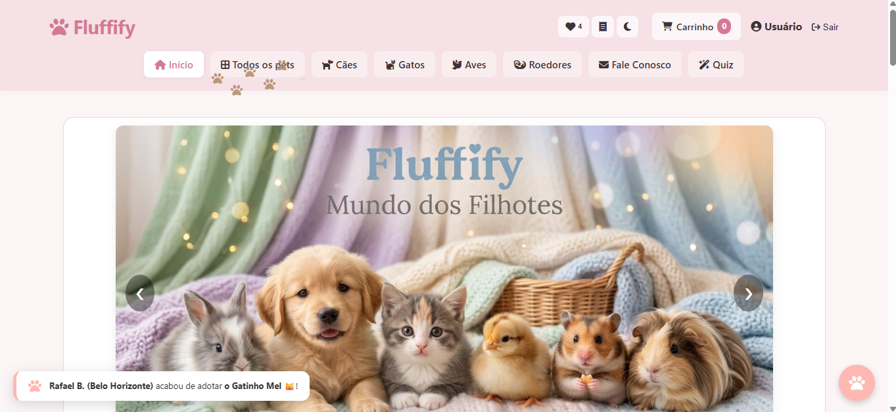
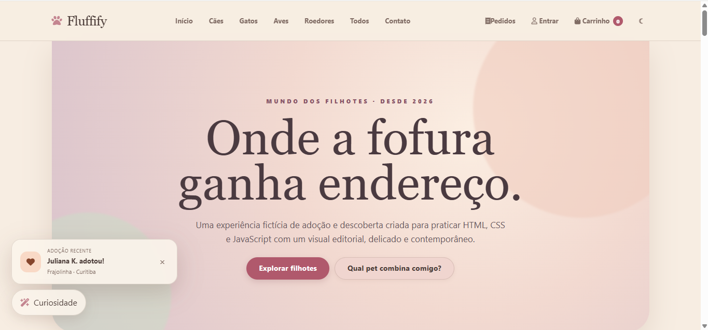

# 🐾 Fluffify

> A fictional pet shop website, built in two stages: from a first experiment with HTML and CSS to a more complete, store-like experience.

**Live demo:** [Part 1](https://giuliasamogin.github.io/Fluffify/Parte-1/) · [Part 2](https://giuliasamogin.github.io/Fluffify/Parte-2/)

## Preview

| Part 1 | Part 2 |
| --- | --- |
|  |  |
| *The first version: a playful experiment.* | *The second version: a more commercial look.* |

## About the project

Fluffify is a multi-page pet shop website created during the HTML and CSS course at Fundação Bradesco. It is the **first project I ever built**, so I decided to keep both versions online to show how my work evolved.

## Two versions, one learning journey

| | Part 1 | Part 2 |
| --- | --- | --- |
| **Goal** | Experiment and learn the basics | Make the site feel like a real store |
| **Approach** | A playful test: getting familiar with HTML structure, CSS styling and links between pages | A more commercial look and feel, with the pages and details a real shop needs |
| **Link** | [Open Part 1](https://giuliasamogin.github.io/Fluffify/Parte-1/) | [Open Part 2](https://giuliasamogin.github.io/Fluffify/Parte-2/) |

**Part 1** was my sandbox. I used it to understand how a website is put together and to try things out without pressure.

**Part 2** took what I learned and gave it a purpose: instead of just practicing, I treated the site as if it belonged to a real business, thinking about the visitor and the shopping experience.

## Features

- Catalog organized by animal type (dogs, cats, birds and rodents), plus a page with all pets
- Shopping cart page
- Login and sign-up forms
- Contact page
- Privacy policy and terms of use pages
- Interactive carousel and extra visual effects with JavaScript
- Consistent navigation and a shared stylesheet across all pages

## Built with

- **HTML5**: page structure, forms and links between pages
- **CSS3**: layout and styling, shared by every page through `style.css`
- **JavaScript**: carousel (`carrossel.js`) and interactive features (`script.js`, `patinhas.js`)
- **GitHub Pages**: free hosting for the live demo

## Project structure

```
Fluffify/
├── Parte-1/          # first version: the experiment
├── Parte-2/          # second version: the more commercial take
├── .gitignore
└── README.md
```

## Running locally

1. Clone the repository:
```
   git clone https://github.com/giuliasamogin/Fluffify.git
```
2. Open the `Parte-1` or `Parte-2` folder and double-click `index.html`. You can also use a local server, such as the VS Code Live Server extension.

No installation or build step is needed.

## What I learned

- Structuring a multi-page website with consistent navigation
- Building forms for login, sign-up and contact
- Styling a whole site from a single stylesheet
- Adding interactivity with JavaScript
- Using Git and GitHub to version and publish a project
- Publishing a static site with GitHub Pages
- Improving a project over time instead of leaving the first version as it was

## Author

**Giulia Samogin**
[GitHub](https://github.com/giuliasamogin)

Developed during the HTML and CSS course at Fundação Bradesco.
